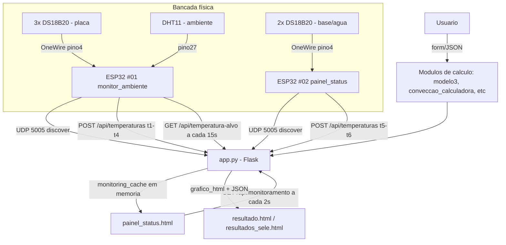

# Arquitetura

## Visão geral

O projeto tem dois subsistemas que se cruzam num único backend Flask:

1. **Calculadoras de engenharia** (aletas, convecção, mudança de fase, arranjos de
   tubos, escoamento interno) — cálculo síncrono via formulário/JSON, sem estado
   persistente, resultado renderizado em template ou devolvido como JSON + gráfico Plotly.
2. **Monitoramento de bancada em tempo real** — dois ESP32 leem sensores de temperatura
   e enviam HTTP POST para o mesmo Flask, que mantém um cache em memória consumido por
   polling no dashboard (`painel_status.html`).

## Subsistemas e responsabilidade

| Subsistema | Onde vive | Estado |
|---|---|---|
| Backend Flask (roteamento, cache de sensores) | `app.py` | Único ponto de entrada; roda em memória, sem banco de dados |
| Módulos de cálculo (engenharia térmica) | `modelo3.py`, `conveccao_calculadora.py`, `mudanca_fase_calculadora.py`, `arranjos_tubos_calculadora.py`, `escoamento_dutos.py`, `escoamento_interno.py`, `metricas_engenharia.py`, `tipos_aletas_config.py` | Puros/sem estado, chamados a cada request |
| Geração de gráficos | `visualizacao_plotly.py` | Gera HTML Plotly + JSON dos mesmos dados (fonte única compartilhada com a tabela) |
| Firmware sensores | `esp32_monitor_ambiente/`, `esp32_painel_status/` | Dois `.ino` independentes, mesma arquitetura de leitura/filtro/envio |
| Dashboard tempo real | `templates/painel_status.html` | Polling client-side, sem WebSocket |
| Frontend calculadoras | `templates/*.html` + `static/js/*` | Server-rendered + fetch JSON para variantes AJAX |

## Por que não há banco de dados

`monitoring_cache` e `temperatura_alvo_data` são dicts Python globais protegidos por
`threading.Lock`, vivendo só na memória do processo Flask. Reiniciar o servidor zera as
leituras. Isso é intencional para o escopo atual (bancada de laboratório, não produção
contínua) — ver [KNOWN_ISSUES.md](KNOWN_ISSUES.md) se isso virar um problema real.

## Descoberta de rede (por que não há IP fixo)

O Flask escuta UDP na porta 5005 (`_iniciar_auto_discovery_udp`, `app.py:109-143`) e
responde a um broadcast `TCC_DISCOVER_SERVER` dos ESP32 com `TCC_SERVER_IP:<porta>`.
Isso evita configurar IP fixo no firmware toda vez que a rede Wi-Fi do laboratório muda.
Fallback: mDNS (`GalaxyBook4Pro.local`) e por último um IP hardcoded no `.ino`.

Detalhes de cada rota: [API_MAP.md](API_MAP.md). Fluxo completo sensor→dashboard:
[DATA_FLOW.md](DATA_FLOW.md).
